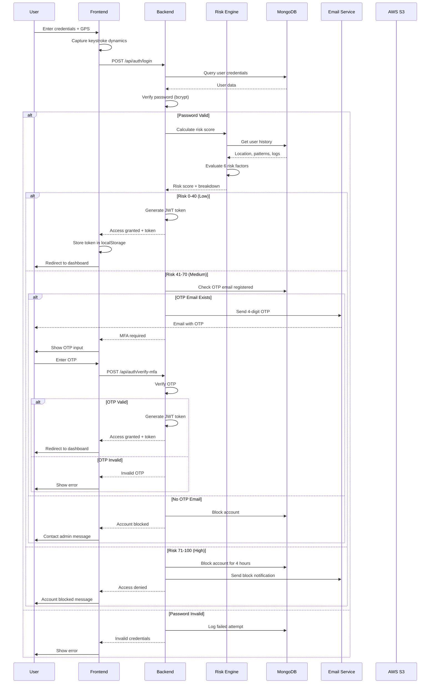
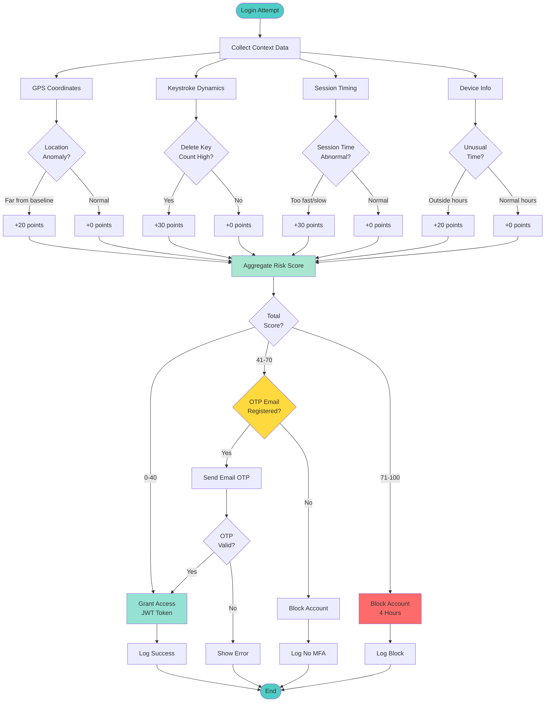
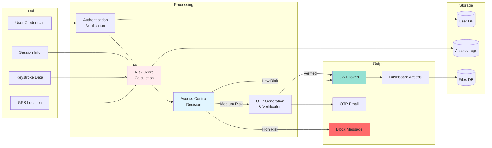
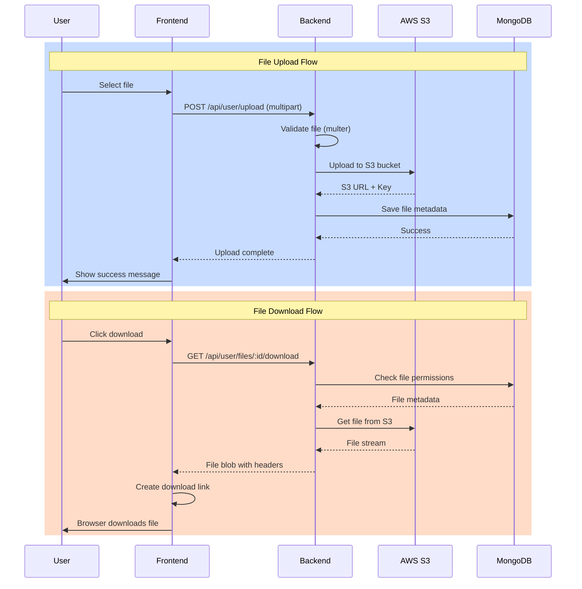
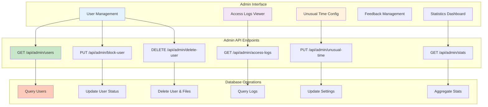
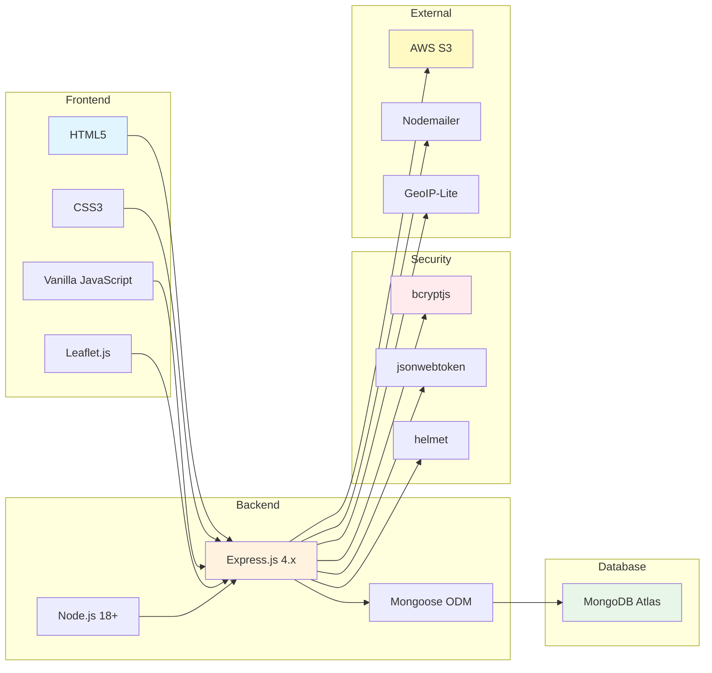

# System Architecture Diagram

## Complete System Architecture

```mermaid
graph TB
    subgraph "Client Layer"
        A[Web Browser]
        A1[Login/Signup Form]
        A2[GPS Location Capture]
        A3[Keystroke Dynamics]
        A4[Access Control Page]
        A5[User Dashboard]
        A6[Admin Dashboard]
    end

    subgraph "Frontend Layer"
        B[HTML/CSS/JavaScript]
        B1[auth.js - Authentication]
        B2[user-dashboard.js]
        B3[admin-dashboard.js]
        B4[config.js - API Config]
        B5[Leaflet.js - Maps]
    end

    subgraph "Backend Layer - Express.js/Node.js"
        C[API Routes]
        C1[auth.js - Auth Routes]
        C2[user.js - User Routes]
        C3[admin.js - Admin Routes]
        
        D[Middleware]
        D1[authMiddleware - JWT Verify]
        D2[adminMiddleware - Role Check]
        D3[multer - File Upload]
        
        E[Services]
        E1[Risk Assessment Engine]
        E2[Email Service - Nodemailer]
        E3[S3 Service - AWS SDK]
    end

    subgraph "Risk Assessment Engine"
        R1[Location Anomaly - 20pts]
        R2[Keystroke Anomaly - 30pts]
        R3[Session Time - 30pts]
        R4[Unusual Time - 20pts]
        R5[Failed Attempts]
        R6[Impossible Travel]
        R7[Risk Score Calculator]
        R8[Decision Engine]
    end

    subgraph "Database Layer - MongoDB Atlas"
        F[(User Collection)]
        G[(AccessLog Collection)]
        H[(File Collection)]
        I[(Feedback Collection)]
        J[(Settings Collection)]
    end

    subgraph "External Services"
        K[AWS S3 Storage]
        L[Email SMTP Server]
        M[GeoIP Service]
    end

    subgraph "Security Components"
        S1[bcrypt - Password Hash]
        S2[JWT - Token Generation]
        S3[OTP Generator]
        S4[Haversine Distance]
    end

    %% Client to Frontend
    A --> B
    A1 --> B1
    A2 --> B1
    A3 --> B1
    A4 --> B1
    A5 --> B2
    A6 --> B3

    %% Frontend to Backend
    B1 --> C1
    B2 --> C2
    B3 --> C3
    B4 --> C

    %% Backend Routes to Middleware
    C1 --> D1
    C2 --> D1
    C3 --> D1
    C3 --> D2
    C2 --> D3

    %% Middleware to Services
    D1 --> E1
    C1 --> E1
    C1 --> E2
    C2 --> E3

    %% Risk Assessment Flow
    E1 --> R1
    E1 --> R2
    E1 --> R3
    E1 --> R4
    E1 --> R5
    E1 --> R6
    R1 --> R7
    R2 --> R7
    R3 --> R7
    R4 --> R7
    R5 --> R7
    R6 --> R7
    R7 --> R8

    %% Database Connections
    C1 --> F
    C1 --> G
    C2 --> F
    C2 --> H
    C3 --> F
    C3 --> G
    C3 --> I
    C3 --> J

    %% External Services
    E3 --> K
    E2 --> L
    E1 --> M

    %% Security Components
    C1 --> S1
    C1 --> S2
    E2 --> S3
    E1 --> S4

    style A fill:#e1f5ff
    style B fill:#fff3e0
    style C fill:#f3e5f5
    style E1 fill:#ffebee
    style F fill:#e8f5e9
    style K fill:#fff9c4
    style R7 fill:#ff6b6b
    style R8 fill:#4ecdc4
```

## Authentication Flow

## Risk Assessment Flow

## Data Flow Diagram

## File Upload/Download Flow

## Admin Dashboard Architecture

## Technology Stack Diagram

